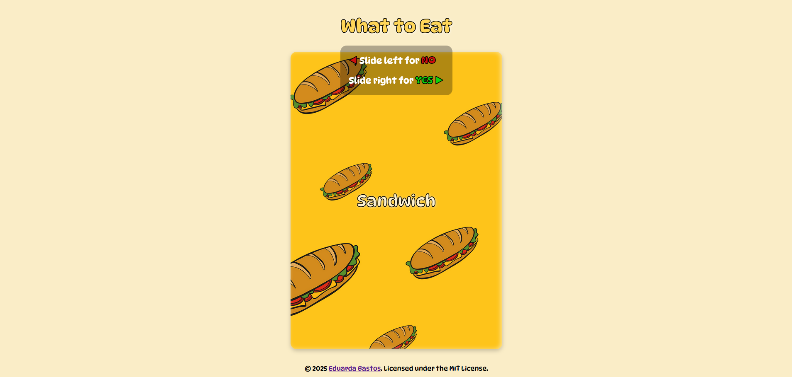

  
# What to Eat

<i>Interactive web app to choose what to eat by swiping food options left or right.</i>

<kbd>  </kbd>

 

 

## Table of Contents
- [Features](#features)
- [How to Use](#how-to-use)
- [Performance Score](#pagespeed-insights-performance-score)
- [Contributing](#contributing)
- [License](#license)

 

## Features

- **Interactive Swipe Cards**: Drag the food category cards left or right to indicate your preference.
- **Dynamic Suggestions**: Categories update automatically based on your choices.
- **Responsive Design**: Works seamlessly on both desktop and mobile devices.

 

## How to Use

1. **Explore Categories**: View the food category displayed on the card.
2. **Swipe Left or Right**: Drag the card to the right if you like it, or to the left if you don’t.
3. **See Your Choices**: The app removes disliked options and cycles through remaining categories.
4. **Discover Your Meal**: When only one category remains, it’s highlighted your final choice. Bon Appétit!

 

## PageSpeed Insights Performance Score

  
| [Desktop](https://pagespeed.web.dev/analysis/https-eduardasrbastos-github-io-what-to-eat/zacmq8kevy?form_factor=desktop) | [Mobile](https://pagespeed.web.dev/analysis/https-eduardasrbastos-github-io-what-to-eat/zacmq8kevy?form_factor=mobile) |
|-------|-------|
| <kbd>  </kbd> | <kbd>  </kbd> |

## Contributing
- Support this project by giving it a star ⭐. Thanks!
- Feel free to suggest improvements or report any issues in the repository.

## License
This project is licensed under the MIT License - see the [LICENSE](LICENSE) file for details.
